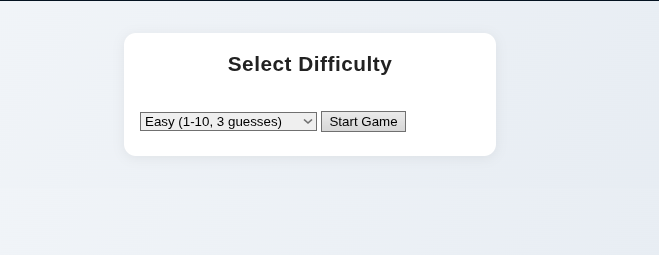
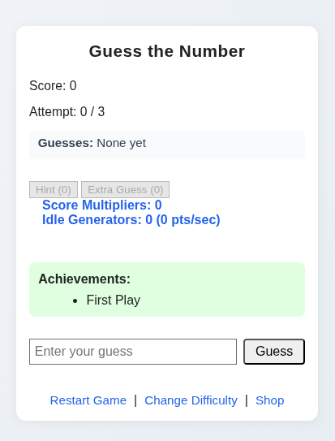
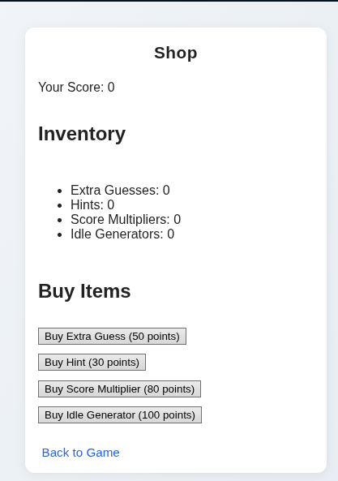

<h1 align="center" id="title">Number Guessing Game</h1>

<p id="description">Hello welcome to my Number Guessing Game if you would like to lay now press</p>

<h2>🚀 Demo</h2>

[https://guessing-game-csjb.onrender.com](https://guessing-game-csjb.onrender.com)

<h2>Project Screenshots:</h2>





<h2>🛠️ Installation Steps:</h2>

<p>1. Install python (Linux)</p>

```
sudo apt install python3
```

<p>2. Install Flask (Linux)</p>

```
pip install flask
```